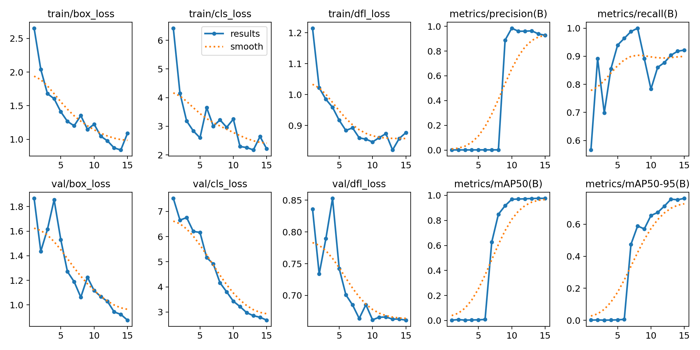
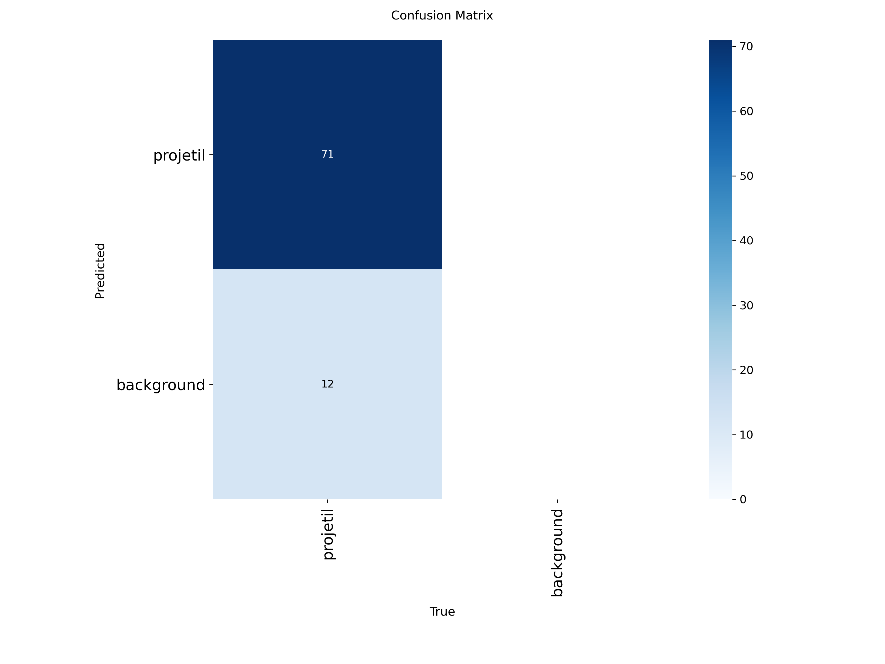

# 🎯 Ballistic Trajectory Tracking PoC

Esta Prova de Conceito (PoC) implementa um pipeline completo de visão computacional para detecção e rastreamento contínuo de projéteis balísticos (`7.62x51mm`) em sequências de imagens de alta velocidade obtidas do dataset **dvs-benchmark-2021** (capturadas por uma câmera Photron a 10.000+ FPS).

---

## 🛠️ Arquitetura da Solução

O sistema combina *deep learning* para detecção local com estimativa estatística para predição e suavização de trajetória:

1. **Detecção com YOLOv8n (Nano):**
   * Ajustada para inferência em tempo real em alvos pequenos de altíssima velocidade.
   * Treinada em sequências rotuladas do benchmark para extrair as coordenadas do *Bounding Box* ($x, y, w, h$).

2. **Filtro de Kalman 2D (Estimador de Trajetória):**
   * **Vetor de Estado:** $x_k = [x, y, v_x, v_y]^T$ (Posição e Velocidade nos eixos $X$ e $Y$).
   * **Matriz de Transição de Estado:** Modelo cinemático de velocidade constante.
   * **Matriz de Medição:** Correção baseada nas detecções confirmadas do YOLOv8.
   * **Suavização e Predição:** Mantém o rastreamento ativo e a linha de trajetória predita, reduzindo o impacto de ruídos e eventuais falhas pontuais de detecção em frames individuais.

---

## 📊 Métricas do Estudo e Treinamento

O modelo YOLOv8n foi treinado e avaliado com os seguintes parâmetros principais:

* **Arquitetura Base:** YOLOv8n (Ultralytics)
* **Épocas Executadas:** 15
* **Entrada de Imagem:** Sequências extraídas de HDF5 (Frames 640x280)
* **Classe:** `projectile` (Projétil Balístico)

### 📈 Gráficos de Desempenho

| Curva de Aprendizado e Perda | Matriz de Confusão |
| :---: | :---: |
|  |  |

| Curva Precision-Recall | Curva F1-Score |
| :---: | :---: |
|  |  |

---

## 💾 Acesso ao Dataset e Dados Brutos

Devido às restrições de tamanho do GitHub para arquivos binários pesados e sequências brutas de imagens (>100MB), os dados completos do estudo estão hospedados e disponíveis no Google Drive:

* 📦 **[Download dos Dados Brutos e Dataset Completo no Google Drive](https://drive.google.com/drive/folders/1aXLlIFjckZUjw9S7efkmZucNnwpiSVRJ)** *(Substitua este link pelo link da sua pasta compartilhada do Google Drive)*

### Conteúdo Disponível no Drive:
1. `ballistic_experiments.hdf5`: Arquivo HDF5 contendo as sequências completas do benchmark **dvs-benchmark-2021** (Câmera Photron 10.000+ FPS e eventos ATIS/DVS).
2. `data/extracted/photron/`: Sequência completa de frames PNG extraídos.
3. `models/yolo_ballistic_poc/`: Checkpoints completos de treinamento e logs das 15 épocas.

---

## 📁 Estrutura do Repositório

```text
ballistic-tracking-poc/
├── docs/
│   ├── demo_tracking.mp4     # Vídeo gerado demonstrando a detecção + linha de trajetória
│   └── plots/                # Gráficos das métricas do treinamento
├── models/
│   └── best.pt               # Pesos treinados do modelo YOLOv8n
├── src/
│   ├── train_yolo.py         # Script de extração HDF5 e treinamento do YOLOv8
│   └── tracking_pipeline.py  # Script principal de execução do pipeline
├── .gitignore                # Regras para ignorar arquivos pesados (>100MB)
├── README.md                 # Documentação do projeto
└── requirements.txt          # Dependências do Python

🏃 Como Executar
1. Requisitos e Instalação
Clone o repositório e instale as dependências necessárias:
git clone [https://github.com/edu-moraess/ballistic-tracking-poc.git](https://github.com/edu-moraess/ballistic-tracking-poc.git)
cd ballistic-tracking-poc
pip install -r requirements.txt

2. Executando o Treinamento e Extração dos Dados
Para extrair a sequência do arquivo HDF5 e treinar o modelo YOLOv8n:
python src/train_yolo.py

3. Executando o Pipeline de Rastreamento (YOLOv8 + Filtro de Kalman)
Para rodar a inferência e gerar o vídeo com a trajetória balística rastreada:
python src/tracking_pipeline.py

🎬 Demonstração Visual
O resultado do rastreamento com caixa delimitadora em tempo real (verde) e histórico de trajetória (vermelho) está disponível na pasta docs/demo_tracking.mp4.

---

### Dica rápida para colocar no GitHub:
1. Abra o repositório [github.com/edu-moraess/ballistic-tracking-poc](https://github.com/edu-moraess/ballistic-tracking-poc).
2. Clique no arquivo **`README.md`** (ou em **Add file** $\rightarrow$ **Create new file** se ele ainda não existir).
3. Cole todo o bloco acima.
4. Lembre-se apenas de trocar `[https://drive.google.com/drive/folders/SEU_LINK_AQUI](https://drive.google.com/drive/folders/SEU_LINK_AQUI)` pelo link de compartilhamento da pasta do seu Google Drive.
5. Clique no botão verde **Commit changes...** no canto superior direito.

